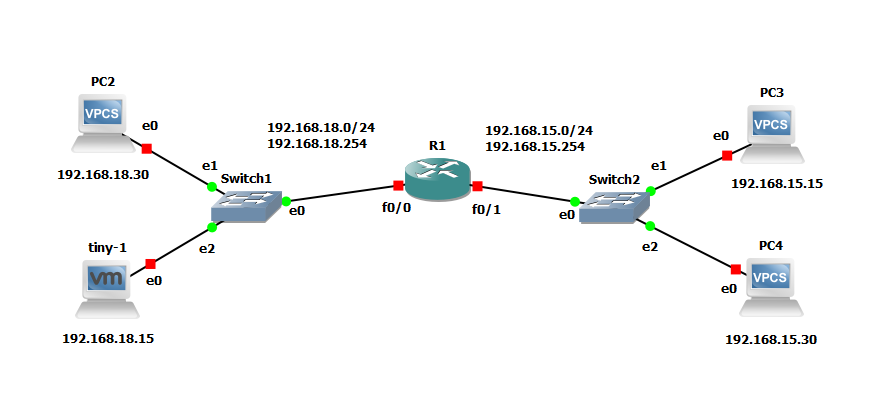
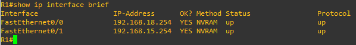
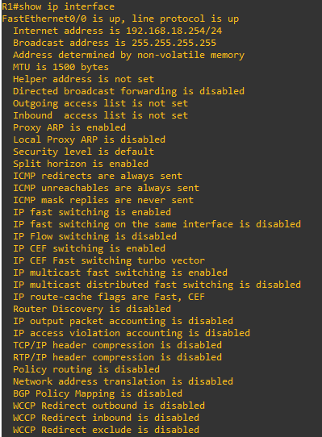
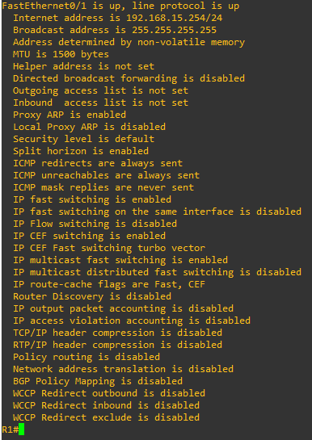

# Docs

You are asked to configure and manage the devices of a network infrastructure for a company which is starting to grow and want to implement a network, a network architect provides them with the **[design of the topology](#Topology)** that will be used by said company, but they must configure it to provide communication according to the needs indicated.

You must configure and manage the equipment of a network infrastructure for a company which has **[4 hosts](#Hosts)** which are connected to 2 different switches and these are connected to each other through a **[router](#Router)** which will be the main communication center.

- [Topology](#Topology)
- [Description](#Description)
- [Routers](#Routers)
- [Switches](#Switches)
- [VPCS](#VPCS)
- [VMS](#VMS)
- [Configuration](#Configuration)
- [Vocabulary](#Vocabulary)
- [Downloads](./downloads.md)


## Topology



## Description

For the configuration of the requested topology, the following tables are provided, with the IP addresses and router configurations necessary for its correct implementation.

### Router

| Interface | Network Address | IP Address     |
| --------- | --------------- | -------------- |
| f0/0      | 192.168.1X.0/24 | 192.168.1X.254 |
| f0/1      | 192.168.1Y.0/24 | 192.168.1Y.254 |

**where x = 8 and y = 5*


### Hosts

| Type      | Name   | Connected To | IP Address    |
| --------- | ------ | ------------ | ------------- |
| TinyLinux | tiny-1 | Switch1      | 192.168.1X.30 |
| VPCS      | PC2    | Switch1      | 192.168.1X.15 |
| VPCS      | PC3    | Switch2      | 192.168.1Y.15 |
| VPCS      | PC4    | Switch2      | 192.168.1Y.30 |

**where x = 8 and y = 5*


## Devices

### Routers

[Download Cisco Images](https://docs.gns3.com/docs/emulators/cisco-ios-images-for-dynamips)

No additional configuration required

### Switches

They already exist within the tool

### VPCS

They already exist within the tool

### VMS

[Download and Configure TinyLinux](https://docs.gns3.com/docs/emulators/adding-vmware-vms-to-gns3-topologies)


## Configuration

### Router

##### Commands

```sh
R1# configure terminal
```

Fast Ethernet 0/0

```sh
R1(config)# interface fastEthernet 0/0
```

```sh
R1(config-if)# full-duplex
```

```sh
R1(config-if)# speed 100
```

```sh
R1(config-if)# ip address 192.168.18.254 255.255.255.0
```

```sh
R1(config-if)# no shutdown
```

```sh
R1(config-if)# exit
```

Fast Ethernet 0/1

```sh
R1(config)# interface fastEthernet 0/1
```

```sh
R1(config-if)# full-duplex
```

```sh
R1(config-if)# speed 100
```

```sh
R1(config-if)# ip address 192.168.15.254 255.255.255.0
```

```sh
R1(config-if)# no shutdown
```

```sh
R1(config-if)# exit
```

Verify

```sh
R1(config)# exit
```

```sh
R1# show ip interface brief
```

#### Outputs

Summary



Details

| FastEthernet0/0                                       | FastEthernet0/1                                       |
| ----------------------------------------------------- | ----------------------------------------------------- |
|  |  |


### VPCS

##### Commands

PC2

```sh
PC2$ ip 192.168.18.30 192.168.18.254 24
```

PC3

```sh
PC3$ ip 192.168.15.15 192.168.15.254 24
```

PC4

```sh
PC4$ ip 192.168.15.30 192.168.15.254 24
```


### VMS


## Vocabulary

#### **Router**

A **router**[[a\]](https://en.wikipedia.org/wiki/Router_(computing)#cite_note-2) is a [networking device](https://en.wikipedia.org/wiki/Networking_device) that forwards [data packets](https://en.wikipedia.org/wiki/Data_packet) between [computer networks](https://en.wikipedia.org/wiki/Computer_network). Routers perform the traffic directing functions on the [Internet](https://en.wikipedia.org/wiki/Internet). Data sent through the internet, such as a [web page](https://en.wikipedia.org/wiki/Web_page) or [email](https://en.wikipedia.org/wiki/Email), is in the form of data packets. A packet is typically [forwarded](https://en.wikipedia.org/wiki/Packet_forwarding) from one router to another router through the networks that constitute an [internetwork](https://en.wikipedia.org/wiki/Internetwork) (e.g. the Internet) until it reaches its destination [node](https://en.wikipedia.org/wiki/Node_(networking)).[[2\]](https://en.wikipedia.org/wiki/Router_(computing)#cite_note-3)

A router is connected to two or more data lines from different [IP networks](https://en.wikipedia.org/wiki/IP_network).[[b\]](https://en.wikipedia.org/wiki/Router_(computing)#cite_note-4) When a data packet comes in on one of the lines, the router reads the [network address](https://en.wikipedia.org/wiki/Network_address) information in the packet header to determine the ultimate destination. Then, using information in its [routing table](https://en.wikipedia.org/wiki/Routing_table) or [routing policy](https://en.wikipedia.org/wiki/Routing_policy), it directs the packet to the next network on its journey.

The most familiar type of IP routers are [home and small office routers](https://en.wikipedia.org/wiki/Residential_gateway) that simply forward [IP packets](https://en.wikipedia.org/wiki/IP_packet_(disambiguation)) between the home computers and the Internet. More sophisticated routers, such as enterprise routers, connect large business or ISP networks up to the powerful [core routers](https://en.wikipedia.org/wiki/Core_router) that forward data at high speed along the [optical fiber](https://en.wikipedia.org/wiki/Optical_fiber) lines of the [Internet backbone](https://en.wikipedia.org/wiki/Internet_backbone). 

*[Wikipedia](https://en.wikipedia.org/wiki/Router_(computing))*

#### Host

A **network host** is a [computer](https://en.wikipedia.org/wiki/Computer) or other device connected to a [computer network](https://en.wikipedia.org/wiki/Computer_network). A host may work as a [server](https://en.wikipedia.org/wiki/Server_(computing)) offering information resources, services, and applications to users or other hosts on the network. Hosts are assigned at least one [network address](https://en.wikipedia.org/wiki/Network_address).

A computer participating in networks that use the [Internet protocol suite](https://en.wikipedia.org/wiki/Internet_protocol_suite) may also be called an **IP host**. Specifically, computers participating in the [Internet](https://en.wikipedia.org/wiki/Internet) are called **Internet hosts**. Internet hosts and other IP hosts have one or more [IP addresses](https://en.wikipedia.org/wiki/IP_address) assigned to their network interfaces. The addresses are configured either manually by an administrator, automatically at startup by means of the [Dynamic Host Configuration Protocol](https://en.wikipedia.org/wiki/Dynamic_Host_Configuration_Protocol) (DHCP), or by [stateless address autoconfiguration](https://en.wikipedia.org/wiki/Stateless_address_autoconfiguration) methods.

Network hosts that participate in applications that use the [client–server model](https://en.wikipedia.org/wiki/Client–server_model) of computing, are classified as [server](https://en.wikipedia.org/wiki/Server_(computing)) or [client](https://en.wikipedia.org/wiki/Client_(computing)) systems. Network hosts may also function as nodes in [peer-to-peer](https://en.wikipedia.org/wiki/Peer-to-peer) applications, in which all nodes share and consume resources in an equipotent manner.

[*Wikipedia*](https://en.wikipedia.org/wiki/Host_(network))

#### VPCS

Virtual PC Simulator is a program written by Paul Meng, which allows you to simulate a lightweight PC supporting DHCP and ping. It consumes only 2MB of RAM per instance, and does not require an additional image.

[*GNS3* docs](https://docs.gns3.com/docs/emulators/vpcs/#:~:text=Virtual%20PC%20Simulator%20is%20a,not%20require%20an%20additional%20image.)

#### Switch

A **network switch** (also called **switching hub**, **bridging hub**, and by the [IEEE](https://en.wikipedia.org/wiki/IEEE) **MAC bridge**)[[1\]](https://en.wikipedia.org/wiki/Network_switch#cite_note-1) is [networking hardware](https://en.wikipedia.org/wiki/Networking_hardware) that connects devices on a [computer network](https://en.wikipedia.org/wiki/Computer_network) by using [packet switching](https://en.wikipedia.org/wiki/Packet_switching) to receive and forward data to the destination device.

A network switch is a multiport [network bridge](https://en.wikipedia.org/wiki/Network_bridge) that uses [MAC addresses](https://en.wikipedia.org/wiki/MAC_address) to forward data at the [data link layer](https://en.wikipedia.org/wiki/Data_link_layer) (layer 2) of the [OSI model](https://en.wikipedia.org/wiki/OSI_model). Some switches can also forward data at the [network layer](https://en.wikipedia.org/wiki/Network_layer) (layer 3) by additionally incorporating [routing](https://en.wikipedia.org/wiki/Routing) functionality. Such switches are commonly known as layer-3 switches or [multilayer switches](https://en.wikipedia.org/wiki/Multilayer_switch).[[2\]](https://en.wikipedia.org/wiki/Network_switch#cite_note-layer3-2)

Switches for [Ethernet](https://en.wikipedia.org/wiki/Ethernet) are the most common form of network switch. The first Ethernet switch was introduced by [Kalpana](https://en.wikipedia.org/wiki/Kalpana_(company)) in 1990.[[3\]](https://en.wikipedia.org/wiki/Network_switch#cite_note-3) Switches also exist for other types of networks including [Fibre Channel](https://en.wikipedia.org/wiki/Fibre_Channel), [Asynchronous Transfer Mode](https://en.wikipedia.org/wiki/Asynchronous_Transfer_Mode), and [InfiniBand](https://en.wikipedia.org/wiki/InfiniBand).

Unlike less advanced [repeater hubs](https://en.wikipedia.org/wiki/Repeater_hub), which broadcast the same data out of each of its ports and let the devices decide what data they need, a network switch forwards data only to the devices that need to receive it.[[4\]](https://en.wikipedia.org/wiki/Network_switch#cite_note-4)

[*Wikipedia*](https://en.wikipedia.org/wiki/Network_switch)

#### IP Address

An **Internet Protocol address** (**IP address**) is a numerical label assigned to each device connected to a [computer network](https://en.wikipedia.org/wiki/Computer_network) that uses the [Internet Protocol](https://en.wikipedia.org/wiki/Internet_Protocol) for communication.[[1\]](https://en.wikipedia.org/wiki/IP_address#cite_note-rfc760-1)[[2\]](https://en.wikipedia.org/wiki/IP_address#cite_note-rfc791-2) An IP address serves two main functions: host or network interface [identification](https://en.wikipedia.org/wiki/Identification_(information)) and location [addressing](https://en.wikipedia.org/wiki/Network_address).

[Internet Protocol version 4](https://en.wikipedia.org/wiki/IPv4) (IPv4) defines an IP address as a [32-bit](https://en.wikipedia.org/wiki/32-bit) number.[[2\]](https://en.wikipedia.org/wiki/IP_address#cite_note-rfc791-2) However, because of the growth of the [Internet](https://en.wikipedia.org/wiki/Internet) and the [depletion of available IPv4 addresses](https://en.wikipedia.org/wiki/IPv4_address_exhaustion), a new version of IP ([IPv6](https://en.wikipedia.org/wiki/IPv6)), using 128 bits for the IP address, was standardized in 1998.[[3\]](https://en.wikipedia.org/wiki/IP_address#cite_note-rfc1883-3)[[4\]](https://en.wikipedia.org/wiki/IP_address#cite_note-rfc2460-4)[[5\]](https://en.wikipedia.org/wiki/IP_address#cite_note-rfc8200-5) [IPv6 deployment](https://en.wikipedia.org/wiki/IPv6_deployment) has been ongoing since the mid-2000s.

IP addresses are written and displayed in [human-readable](https://en.wikipedia.org/wiki/Human-readable) notations, such as *172.16.254.1* in IPv4, and *2001:db8:0:1234:0:567:8:1* in IPv6. The size of the routing prefix of the address is designated in [CIDR notation](https://en.wikipedia.org/wiki/CIDR_notation) by suffixing the address with the number of [significant bits](https://en.wikipedia.org/wiki/Bit_numbering), e.g., *192.168.1.15/24*, which is equivalent to the historically used [subnet mask](https://en.wikipedia.org/wiki/Subnet_mask) *255.255.255.0*.

The IP address space is managed globally by the [Internet Assigned Numbers Authority](https://en.wikipedia.org/wiki/Internet_Assigned_Numbers_Authority) (IANA), and by five [regional Internet registries](https://en.wikipedia.org/wiki/Regional_Internet_registry) (RIRs) responsible in their designated territories for assignment to [local Internet registries](https://en.wikipedia.org/wiki/Local_Internet_registry), such as [Internet service providers](https://en.wikipedia.org/wiki/Internet_service_providers) (ISPs), and other [end users](https://en.wikipedia.org/wiki/End_user). IPv4 addresses were distributed by IANA to the RIRs in blocks of approximately 16.8 million addresses each, but have been exhausted at the IANA level since 2011. Only one of the RIRs still has a supply for local assignments in Africa.[[6\]](https://en.wikipedia.org/wiki/IP_address#cite_note-6) Some IPv4 addresses are reserved for [private networks](https://en.wikipedia.org/wiki/Private_network) and are not globally unique.

[Network administrators](https://en.wikipedia.org/wiki/Network_administrator) assign an IP address to each device connected to a network. Such assignments may be on a *static* (fixed or permanent) or *dynamic* basis, depending on network practices and [software](https://en.wikipedia.org/wiki/Software) features.

[*Wikipedia*](https://en.wikipedia.org/wiki/IP_address)

#### Topology

In [mathematics](https://en.wikipedia.org/wiki/Mathematics), **topology** (from the [Greek](https://en.wikipedia.org/wiki/Greek_language) words [τόπος](https://en.wiktionary.org/wiki/τόπος), 'place, location', and λόγος, 'study') is concerned with the properties of a [geometric object](https://en.wikipedia.org/wiki/Mathematical_object) that are preserved under [continuous](https://en.wikipedia.org/wiki/Continuous_function) [deformations](https://en.wikipedia.org/wiki/Deformation_theory), such as [stretching](https://en.wikipedia.org/wiki/Stretch_factor), [twisting](https://en.wikipedia.org/wiki/Twist_(mathematics)), crumpling and bending, but not tearing or [gluing](https://en.wikipedia.org/wiki/Quotient_space_(topology)).

[*Wikipedia*](https://en.wikipedia.org/wiki/Topology)

#### Interface

In computing, an **interface** is a shared boundary across which two or more separate components of a [computer system](https://en.wikipedia.org/wiki/Computer_system) exchange information. The exchange can be between [software](https://en.wikipedia.org/wiki/Software), [computer hardware](https://en.wikipedia.org/wiki/Computer_hardware), [peripheral](https://en.wikipedia.org/wiki/Peripheral) devices, [humans](https://en.wikipedia.org/wiki/User_interface), and combinations of these.[[1\]](https://en.wikipedia.org/wiki/Interface_(computing)#cite_note-HookwayInterface14-1) Some computer hardware devices, such as a [touchscreen](https://en.wikipedia.org/wiki/Touchscreen), can both send and receive data through the interface, while others such as a mouse or microphone may only provide an interface to send data to a given system.[[2\]](https://en.wikipedia.org/wiki/Interface_(computing)#cite_note-2)

[*Wikipedia*](https://en.wikipedia.org/wiki/Interface_(computing))

#### Network

The **Network Computer** (or **NC**) was a [diskless](https://en.wikipedia.org/wiki/Diskless_node) [desktop computer](https://en.wikipedia.org/wiki/Desktop_computer) device made by [Oracle Corporation](https://en.wikipedia.org/wiki/Oracle_Corporation) from about 1996 to 2000. The devices were designed and manufactured by an alliance, which included [Sun Microsystems](https://en.wikipedia.org/wiki/Sun_Microsystems), [IBM](https://en.wikipedia.org/wiki/IBM), and others. The devices were designed with minimum specifications, based on the [Network Computer Reference Profile](https://en.wikipedia.org/wiki/Network_Computer_Reference_Profile). The brand was also employed as a [marketing](https://en.wikipedia.org/wiki/Marketing) term to try to popularize this design of computer within enterprise and among consumers.

[*Wikipedia*](https://en.wikipedia.org/wiki/Network_Computer)

#### Broadcast Domain

A **broadcast domain** is a logical division of a [computer network](https://en.wikipedia.org/wiki/Computer_network), in which all [nodes](https://en.wikipedia.org/wiki/Node_(networking)) can reach each other by [broadcast](https://en.wikipedia.org/wiki/Broadcasting_(computing)) at the [data link layer](https://en.wikipedia.org/wiki/Data_link_layer). A broadcast domain can be within the same [LAN segment](https://en.wikipedia.org/wiki/LAN_segment) or it can be bridged to other LAN segments.

In terms of current popular technologies, any computer connected to the same [Ethernet](https://en.wikipedia.org/wiki/Ethernet) [repeater](https://en.wikipedia.org/wiki/Repeater) or [switch](https://en.wikipedia.org/wiki/Network_switch) is a member of the same broadcast domain. Further, any computer connected to the same set of inter-connected switches/repeaters is a member of the same broadcast domain. [Routers](https://en.wikipedia.org/wiki/Router_(computing)) and other [higher-layer](https://en.wikipedia.org/wiki/Network_layer) devices form boundaries between broadcast domains.

[*Wikipedia*](https://en.wikipedia.org/wiki/Broadcast_domain)

#### Collision Domain

A **collision domain** is a [network segment](https://en.wikipedia.org/wiki/Network_segment) connected by a [shared medium](https://en.wikipedia.org/wiki/Shared_medium) or through [repeaters](https://en.wikipedia.org/wiki/Repeater) where simultaneous [data transmissions](https://en.wikipedia.org/wiki/Data_transmission) [collide](https://en.wikipedia.org/wiki/Collision_(telecommunications)) with one another. The collision domain applies particularly in [wireless networks](https://en.wikipedia.org/wiki/Wireless_network), but also affected early versions of [Ethernet](https://en.wikipedia.org/wiki/Ethernet). A network collision occurs when more than one device attempts to send a packet on a network segment at the same time. Members of a collision domain may be involved in collisions with one another. Devices outside the collision domain do not have collisions with those inside.

[*Wikipedia*](https://en.wikipedia.org/wiki/Collision_domain)